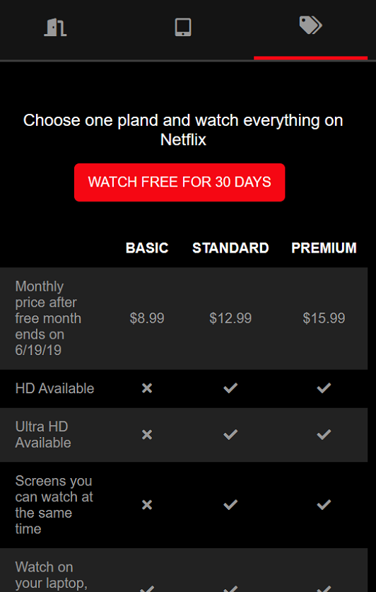

# Netflix Home Page Clone for Android


## Overview

This project is an Android application that replicates the Netflix homepage using the WebView component. It serves as a demonstration of integrating WebView to mimic the appearance and basic functionality of the Netflix homepage within an Android app.

## Features

- WebView integration to display the Netflix homepage.
- Basic styling to replicate the Netflix UI.

## Screenshots
<p align="center">
  
  
  
</p>

  

## Getting Started

### Prerequisites

- Android Studio
- Git

### Installation

1. Clone the repository:
   ```bash
   git clone https://github.com/your-username/netflix-clone-android.git](https://github.com/mrloknath/Netflix/)https://github.com/mrloknath/Netflix/
